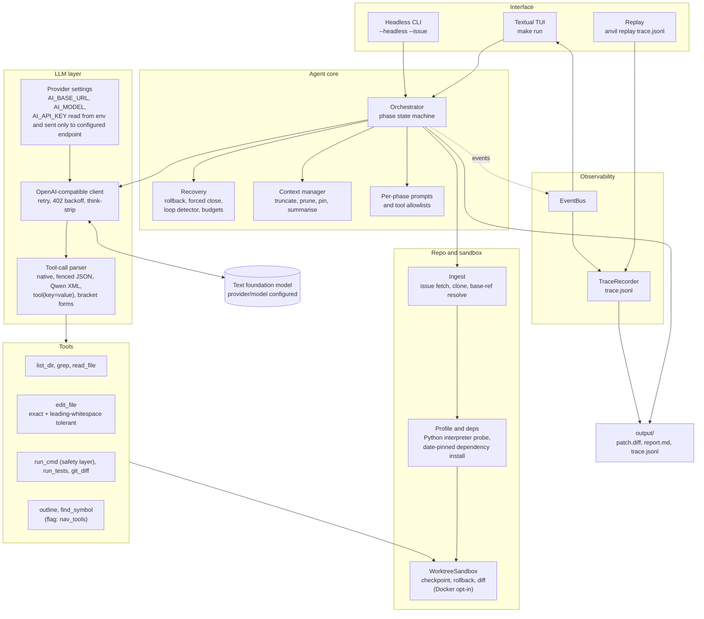

# ⚒ ANVIL — Autonomous Coding-Agent Harness

> Given a GitHub issue URL, ANVIL clones the repo, understands the issue,
> navigates the code, writes a failing reproduction, patches it, verifies the
> fix, self-reviews the diff, and writes a final report — all autonomously,
> using only a text LLM and a curated set of engineering tools.
>
> **Language support:** Implemented, verified on Python only.

---

## Quick start

```bash
# 1. Clone
git clone https://github.com/ParrvLuthra22/anvil.git && cd anvil

# 2. Set your API key (never written to disk)
export AI_API_KEY="your-openai-compatible-key"

# 3. Install everything (idempotent — safe to re-run)
make setup

# 4. Launch the TUI and paste a GitHub issue URL
make run

# Or pass the issue directly:
make run ISSUE=https://github.com/owner/repo/issues/42
```

> **First-time note:** `make setup` will warn (but not fail) if `git` or
> `ripgrep` (`rg`) are missing.  `git` is required for cloning; `rg` is
> optional — the grep tool falls back to system `grep`.

---

## Architecture



The interface starts live work or replays a saved trace. The orchestrator coordinates model phases, context, and recovery. Repository tools operate through the sandbox. Events and output files make each run inspectable.

```mermaid
stateDiagram-v2
  [*] --> INGEST
  INGEST --> PROFILE: repo cloned at resolved ref or default
  PROFILE --> UNDERSTAND: repo profiled, dependency setup attempted
  UNDERSTAND --> LOCALIZE
  LOCALIZE --> REPRODUCE
  LOCALIZE --> REPRODUCE: give_up recorded; continue with low confidence
  REPRODUCE --> PATCH: failing repro confirmed or adopted
  REPRODUCE --> PATCH: give_up; continue with low confidence
  PATCH --> VERIFY
  VERIFY --> REVIEW: verification accepted
  VERIFY --> PATCH: fail; retry or rollback (max 3 PATCH attempts total)
  REVIEW --> FINALIZE: approved
  REVIEW --> PATCH: changes requested; attempts remain
  REVIEW --> FINALIZE: changes requested; no attempts remain
  FINALIZE --> [*]: patch.diff, report.md, trace.jsonl
  PATCH --> FINALIZE: budget exhausted
```



Repository setup precedes the model phases. The normal path confirms a failing reproduction before patching, while an unavailable reproduction lowers confidence. Verification evidence determines whether patching retries or rolls back. Finalization writes the run artifacts when work succeeds or stops.

- **INGEST and PROFILE are plain code.** The issue comes from the GitHub API (or from `--issue-text`), the repository is cloned
  at the revision the issue was reported against (or from `--ref`), the language and test command are detected, and dependency
  setup prepares `.anvil_venv/` when it succeeds. For an old repository, the installer prefers a Python from its era and date-pins
  package installs when supported.
- **The other phases are model tool loops.** Each phase sees only the tools it needs (LOCALIZE cannot edit, REVIEW can run tests
  but cannot edit) and works from the summaries of the phases before it.
- **Reproduce first.** The confirmed path uses a script under `.anvil/` that fails for the reason in the issue. Anything it changes
  outside `.anvil/` during REPRODUCE is reverted, and if it shows the bug but never confirms it, the harness adopts that failing
  command as the repro.
- **The harness checks the facts itself.** It re-runs the repro, reads the diff and counts test failures instead of trusting the
  model. An unfinished VERIFY is decided from that evidence.
- **Bounded.** Each phase has a call cap; when a model does not close a phase, the harness closes it with a summary of what was
  done. A run makes at most 3 PATCH attempts, whatever else asks for one. There are step, token and wall-clock budgets too.
- **Recovery.** Loops are caught (the same call three times in a row, or a fourth identical call in a phase), failed edits get
  the closest real lines, and repeated failures roll back to a checkpoint.
- **The patch is checked before delivery.** It must be non-empty, apply to the base commit, leave the tests alone (unless the
  issue is about tests) and not add a bare `assert`; a patch that fails gets one forced-fix retry when the attempt budget allows it.
- **FINALIZE always runs.** Whatever goes wrong, `patch.diff`, `report.md` and `trace.jsonl` are written.

Behaviour details and the reasons for them are in [`src/anvil/agent/NOTES.md`](src/anvil/agent/NOTES.md).

### Reading `report.md`

| Confidence | Meaning |
|---|---|
| **high** (0.90) | The bug was reproduced before the patch, the patch verified after it, no test run failed, the review approved, and the run was not cut short |
| **medium** (0.60) | Verified, with a caveat: the review asked for changes or did not finish, a test run failed, or verification rested on the repro alone |
| **low** (0.30) | Not reproduced, not verified, or the patch failed its sanity check |
| **none** (0) | No patch |

The **Known limitations** section lists everything the harness had to do for the run: phases it closed itself, a repro it
adopted, a retry that was undone, a limit that stopped patching. Read it before trusting a patch.

---

## Demo mode (no API key needed)

```bash
make demo
```

Plays a scripted fake event stream through the TUI so you can explore the
interface without any API key or network access.

---

## Configuration

All settings live in [`config.yaml`](config.yaml). **No code edit is ever
needed** to change the model or provider.  The table below documents every
key in `config.yaml`:

| Key | Default | Description |
|-----|---------|-------------|
| `model` | `gemini-2.0-flash` | Model name passed to the OpenAI-compatible chat-completions endpoint |
| `base_url` | `https://generativelanguage.googleapis.com/v1beta/openai/` | Provider base URL |
| `model_profile` | `auto` | Model defaults profile: `auto` \| `default` \| `deepseek` \| `deepseek-reasoning` \| `qwen` \| `qwen-reasoning` |
| `temperature` | `0` | Sampling temperature — 0 = deterministic output |
| `max_output_tokens` | Profile: Qwen `4096`, DeepSeek chat `8192`, reasoning models provider default | Cap on tokens per LLM reply (`null` = provider default) |
| `strip_reasoning` | `true` | Strip `<think>...</think>` and `reasoning_content` blocks from replies |
| `llm_extra_params` | `{}` | Extra dictionary of provider-specific parameters sent with every request body |
| `tool_mode` | `auto` | How tools are offered: `native` (provider tool-calling API) \| `text` (describe in prompt) \| `auto` (try native; the first native tool-call failure of a run switches the rest of the run to text mode for good) |
| `llm_max_attempts` | `5` | Total tries per LLM request, including the first |
| `llm_timeout_seconds` | `120` | Per-request read/write timeout |
| `llm_connect_timeout_seconds` | `10` | TCP connect timeout |
| `llm_backoff_base_seconds` | `1.0` | Base for exponential backoff on 429/5xx/network errors |
| `llm_backoff_max_seconds` | `60` | Cap on transient 429/5xx/network retry waits, including `Retry-After` |
| `max_steps_per_phase` | `25` | LLM steps allowed per phase before the orchestrator advances |
| `max_total_steps` | `120` | Hard cap on total LLM steps across all phases |
| `max_tokens_total` | `1 500 000` | Token budget for the whole run; hitting it forces graceful FINALIZE |
| `wall_clock_seconds` | `1800` | 30-minute wall-clock limit; hitting it forces graceful FINALIZE |
| `tool_output_char_cap` | `8000` | Max characters of any single tool/shell output; longer output keeps head + tail with `[N lines omitted]` |
| `token_saving.read_file_max_lines` | `150` | With token budgets on, shorten longer file reads |
| `token_saving.read_file_head_lines` | `60` | Leading lines retained in a shortened read, plus an outline |
| `token_saving.context_keep_steps` | `3` | Tool-result retention window when token budgets are enabled |
| `token_saving.tool_output_char_cap` | `4000` | Tighter output cap when token budgets are enabled |
| `token_saving.repo_map_chars` | `3000` | Repository-map size when token budgets are enabled |
| `token_saving.phase_calls` | `understand=1, localize=8, reproduce=10, patch=15, verify=8, review=6` | Model-call caps for these phases; the harness allows one extra forced-close call |
| `max_context_tokens` | `32000` | Estimated token budget for the prompt (chars ÷ 4); leave headroom for tool schemas |
| `context_keep_steps` | `6` | Tool output from earlier steps is replaced by a one-line summary after this many steps |
| `context_summarize_threshold` | `0.75` | Fraction of `max_context_tokens` that triggers folding old turns into a digest (one extra LLM call) |
| `max_patch_attempts` | `3` | Failed PATCH/VERIFY attempts before rolling back to the pre-PATCH checkpoint |
| `max_rollbacks` | `2` | Maximum rollbacks before the run reports low confidence and stops retrying |
| `max_total_patch_attempts` | `3` | Hard limit of 3 PATCH attempts across the entire run, including the first attempt and retries |
| `install_dependencies` | `true` | Install repo dependencies after profiling (Python: into `.anvil_venv/`); set `false` to skip |
| `command_timeout_seconds` | `120` | Timeout for commands the harness itself runs (repro checks etc.) |
| `output_dir` | `output` | Directory where `patch.diff`, `report.md`, and `trace.jsonl` are written |
| `cost_per_million_prompt_tokens` | `0` | Optional cost reporting (USD per million prompt tokens); 0 = free tier / unknown |
| `cost_per_million_completion_tokens` | `0` | Optional cost reporting (USD per million completion tokens) |
| `sandbox` | `worktree` | Sandbox backend: `worktree` (default) \| `docker` (opt-in and experimental, no network in containers) \| `auto` |
| `features.token_budgets` | `true` | Applies tighter per-phase caps, context retention, read, output, and repo-map limits |
| `features.weak_model_prompts` | `false` | Adds extra minimal-change and exception-handling guidance to PATCH and REVIEW |
| `features.patch_sanity` | `true` | Checks patch validity and test-file edits; a bare `assert` in non-test code is flagged |
| `features.nav_tools` | `false` | Offers `outline` and `find_symbol` in LOCALIZE and PATCH when registered |

`max_output_tokens` is optional and otherwise comes from the selected model
profile/provider (Qwen defaults to 4096 tokens; DeepSeek chat to 8192; reasoning
profiles leave the provider default). `llm_extra_params` is an optional provider-specific mapping.
Nested `token_saving` values only tighten top-level settings when
`features.token_budgets` is enabled. Feature switches accept `true` or `false`.
An HTTP 402 asking the provider to retry after in-flight requests settle gets
up to 5 attempts with jittered waits from 2 to 30 seconds. Other HTTP 402
responses are treated as out of credit and fail without retrying. This is
separate from `llm_max_attempts` and the 429/5xx/network backoff settings.

### Environment overrides (never put these in config.yaml)

| Variable | Effect |
|----------|--------|
| `AI_API_KEY` | **(required)** API key — read only from the environment, never hard-coded |
| `AI_BASE_URL` | Overrides `base_url` without editing `config.yaml` |
| `AI_MODEL` | Overrides `model` without editing `config.yaml` |
| `GITHUB_TOKEN` | *(optional)* Raises GitHub's API rate limit for fetching the issue (see Troubleshooting) |
| `ANVIL_OUTPUT_DIR` | *(optional)* Where `patch.diff`, `report.md` and `trace.jsonl` are written; the benchmark runner sets it per instance |

---

## Entry points

```bash
# Full TUI (default) — requires AI_API_KEY
python -m anvil
python -m anvil --issue <url>

# Headless — runs the same pipeline without the TUI; requires AI_API_KEY.
python -m anvil --issue <url> --headless

# Fallback when GitHub rate-limits you (passes repo URL + description to pipeline)
python -m anvil --repo <repo-url> --issue-text "bug description" --headless

# Demo — fake event stream, no key needed
python -m anvil --demo

# Replay a saved trace without any API calls
python -m anvil replay output/trace.jsonl
python -m anvil replay output/trace.jsonl --speed 4   # 4× fast-forward
python -m anvil replay output/trace.jsonl --speed 0   # instant
```

Every run writes three files to `output/`:

| File | Contents |
|------|----------|
| `output/patch.diff` | Unified diff of all changes |
| `output/report.md` | Human-readable summary |
| `output/trace.jsonl` | Full event log (JSONL) for replay / audit |

---

## TUI keyboard shortcuts

| Key | Action |
|-----|--------|
| `q` | Quit (output files are preserved) |
| `r` | Restart (clear log, reset phases) |
| `d` | Toggle diff preview pane |
| `space` | Pause / resume replay |
| `→` / `l` | Step one event forward (replay) |
| `←` / `h` | Step one event back (replay) |
| `1` / `4` / `0` | Set replay speed to 1× / 4× / instant |

---

## Troubleshooting

| Symptom | What to do |
|---|---|
| `Could not fetch the issue from GitHub: ... rate-limited (HTTP 403)` | GitHub allows 60 unauthenticated API calls an hour. Set `GITHUB_TOKEN`, or skip the API: `python -m anvil --repo <repo-url> --issue-text "the issue" --headless` |
| `Out of credit: ... refused the request (HTTP 402)` | The account behind `AI_API_KEY` has no credit. Add credit, or set `AI_API_KEY`, `AI_BASE_URL` and `AI_MODEL` for another provider. A 402 that asks you to retry after in-flight requests settle is retried automatically |
| `Rate limit exceeded: free-models-per-day` (HTTP 429) | Free models on a provider such as OpenRouter have a daily request cap for the whole account, and a run needs dozens of model calls. Use a paid model or another provider |
| The model answers but never calls tools | Run `python -m anvil.llm.probe` to see which tool mode the endpoint supports. In `auto` mode the client switches to text mode at the first native failure |
| Tests cannot run in an old repository | The dependency step picks the newest Python that existed at the base commit, falls back to `uv python install`, and says what it did in the TUI and `report.md`. Check the message, and that `git` and `uv` are installed |
| `make setup` cannot find a Python | It needs Python 3.11 or newer with `venv`; Homebrew Pythons without `ensurepip` are skipped |

---

## Known limitations

- **Verified on Python repositories only.** The pipeline is language-agnostic (profile, tools, sandbox), but a JavaScript,
  TypeScript, Go, Rust or Java issue has not been run end to end.
- **Small or weak models often do not close phases.** The harness closes them itself and lowers the confidence, so results with
  such a model are usually medium at best.
- **Old repositories depend on the machine.** Their tests need a Python of the right era; without one installed the harness
  fetches it with `uv` (network required).
- **Benchmarks use real provider quota** and clone from GitHub; they are not part of `make test`.

---

## Running tests

```bash
make test           # runs pytest -q (offline, no API key required)
```

All tests are offline — no network, no real LLM, no API key required.

---

## Benchmarks

```bash
make bench
```

`make bench` runs `bench/instances.json`, scores patches in fresh checkouts,
prints the results table and resolved rate, and analyzes traces. Set
`AI_API_KEY` in the environment first. A labelled one-instance run is:

```sh
.venv/bin/python bench/run_bench.py --only <instance-id> --label trial-name
.venv/bin/python bench/score.py
.venv/bin/python bench/analyze.py
```

Benchmark runs consume provider quota and resume by completed instance id. Use
a separate results file when intentionally rerunning completed ids.

---

## Project layout

```
anvil/
├── Makefile                   # setup · run · test · clean · bench · demo
├── config.yaml                # model + budget settings (no secrets)
├── pyproject.toml             # package metadata + dependencies
├── .env.example               # AI_API_KEY=  (only empty placeholder)
│
├── src/anvil/
│   ├── __main__.py            # CLI entry point (Sneha)
│   ├── events.py              # AgentEvent · Phase · EventBus (Parrv)
│   ├── agent/                 # the harness (Parrv)
│   │   ├── orchestrator.py    # runs the phase cycle, checks the facts itself, always finalizes; load_config
│   │   ├── pipeline.py        # INGEST + PROFILE: issue, clone at the right revision, dependencies, sandbox, tools
│   │   ├── loop.py            # one phase: the tool loop, call caps, the harness's own phase close
│   │   ├── closure.py         # the summary the harness writes when it closes a phase itself
│   │   ├── recovery.py        # loop detector, repeated-call refusal, edit hints, checkpoints and rollback
│   │   ├── repro.py           # write_repro tool; does a failing output match the issue?
│   │   ├── sanity.py          # checks on the patch before delivery (empty, applies, tests, bare assert)
│   │   ├── prompts.py         # phase prompts, tool allowlists, kickoff messages
│   │   ├── settings.py · budget.py · usage.py · state.py   # typed settings, budgets, token use, run state
│   │   ├── outputs.py · emitter.py · summarizer.py · text.py · prepared_sandbox.py
│   │   └── NOTES.md           # behaviour notes: what the harness does, and why
│   ├── context/               # context window: pruning, read-file caps, token estimates (Parrv)
│   ├── llm/                   # OpenAI-compatible client, model profiles, text-mode tool-call parser, probe (Parrv)
│   ├── repo/                  # ingest.py (issue + clone) · profile.py (language, test command) · deps.py (dependencies) (Akshat)
│   ├── sandbox/               # Sandbox protocol; worktree (default) and docker (experimental) (Akshat)
│   ├── tools/                 # list_dir · grep · read_file · edit_file · run_cmd · run_tests · git_diff · related_tests
│   │                          # · outline · find_symbol · find_references (Akshat)
│   ├── trace/
│   │   └── recorder.py       # JSONL trace recorder/loader (Sneha)
│   └── tui/
│       └── app.py            # Textual TUI application (Sneha)
│
├── tests/
│   ├── mock_llm.py           # MockLLM + fake_event_stream (Sneha)
│   ├── test_makefile.py      # Makefile security tests (Sneha)
│   ├── test_trace.py         # Trace recorder tests (Sneha)
│   ├── test_tui.py           # TUI tests (Sneha)
│   └── test_*.py             # Per-module tests (Parrv / Akshat)
│
├── bench/
│   ├── instances.json        # Benchmark cases plus scorer-only oracle data
│   ├── run_bench.py          # Headless, resumable runner (Sneha)
│   ├── score.py              # Fresh-checkout patch and test scoring
│   └── analyze.py            # Failure, token, phase, and recovery summaries
│
└── docs/
    ├── ARCHITECTURE.md        # Implemented lifecycle and component contracts
    ├── EVALUATION.md          # Run protocol and measured comparison
    ├── DEMO.md                # Demo walkthrough
    └── sample_trace.jsonl     # Trace sample for offline replay
```

---

## Decisions

See [`docs/ARCHITECTURE.md`](docs/ARCHITECTURE.md) for the full decision log.
Key choices at a glance:

- **Phase state machine** — explicit phases give the LLM a focused prompt and a bounded budget per sub-task; they also make the TUI legible.
- **Reproduce-first** — writing a failing test before patching prevents placebo patches and gives a binary pass/fail signal for verification.
- **Worktree sandbox** — `git worktree` isolates every run without Docker overhead; Docker sandbox is opt-in and experimental.
- **Event bus** — decouples the agent from the TUI and the trace recorder; replay is free.
- **JSONL trace** — append-only, crash-safe, streamable; one line per event.

---

## License

MIT — see `LICENSE`.
