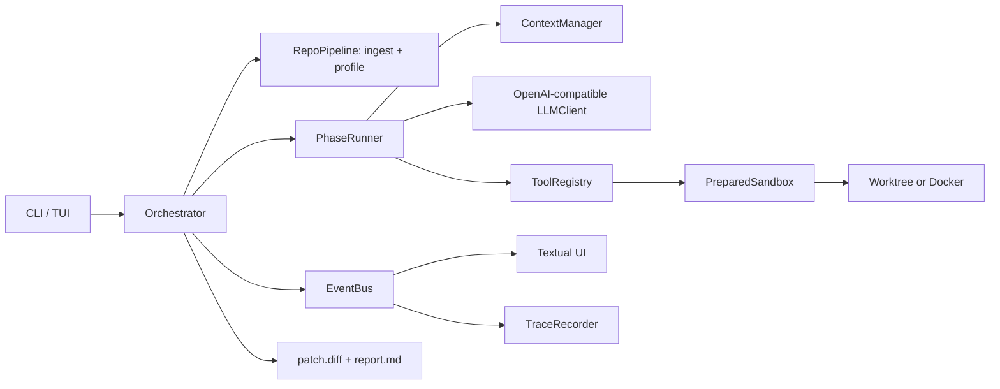

# ANVIL Architecture

ANVIL is a text-model coding harness. `python -m anvil` enters the Textual UI;
`--headless` runs the same pipeline without the UI. `run_harness()` owns a run,
while `RepoPipeline`, `PhaseRunner`, the tool registry, and the sandbox keep
repository setup, model turns, and filesystem operations separate.

## Run lifecycle and phases

`Orchestrator.run()` catches budget, model, pipeline, and internal failures and
always enters finalization. INGEST and PROFILE are deterministic pipeline work;
the remaining phases are LLM tool loops. Each transition is emitted as a trace
event.

| Phase | Work |
|---|---|
| INGEST | Resolve supplied issue text or fetch a GitHub issue; clone at the selected base revision. |
| PROFILE | Detect languages, framework, dependency and test commands; prepare the sandbox and tools. |
| UNDERSTAND | Form a root cause hypothesis and identify relevant symbols/files. |
| LOCALIZE | Search and read likely code locations. |
| REPRODUCE | Write a minimal failing repro under `.anvil/` and run it before source edits. |
| PATCH | Edit implementation code and run the repro; retry within configured budgets. |
| VERIFY | Run relevant tests and check the repro. Failed verification can return to PATCH. |
| REVIEW | Inspect the diff; one requested rework can return to PATCH. |
| FINALIZE | Sanity-check and write the patch/report, emit `done`, then close resources. |

The phase runner filters tools by phase, validates call arguments, checks loop
patterns, and enforces per-phase and total call/step limits. Global limits also
include tokens and elapsed wall time. Hitting a budget ends model work and
finalizes with the patch available so far.

## Write policy and patch delivery

The model can write only through registered tools operating on the sandbox.
Sandbox paths are resolved under the repository root; absolute paths and paths
that escape the root are rejected. The `write_repro` tool is the exception in
purpose, not location: it creates repro material only beneath `.anvil/`.
`edit_file` performs an exact string replacement and returns a closest-match
hint when the old text is not found. Shell commands run with timeouts, closed
stdin, output caps, and the prepared dependency environment.

Before delivery, `features.patch_sanity` checks that the patch is non-empty and
applies to a scratch checkout at the original base. Test-file changes are
removed from the delivered diff unless the issue is specifically about tests.
An empty or invalid patch gets one forced-fix retry. Harness scratch files,
virtual environments, bytecode, and package metadata are excluded from the
delivered diff.

## Base revision resolution

For headless input, `--ref` is passed as `git_ref`. Revision selection is:

1. An explicit `--ref` / `git_ref`.
2. `anvil.repo.ingest.resolve_base_ref(issue_ref)` for a fetched issue. The
   resolver can report a commit/ref, reason, and whether the issue appears
   already fixed.
3. The repository default branch when no revision can be resolved.

If checkout of a selected ref fails, the pipeline reports a warning and falls
back to the default branch. Supplied `--issue-text` has no GitHub issue number,
so it skips issue-specific base-ref lookup. `--repo` can be used with
`--issue-text` when fetching the issue itself is unavailable.

## Tool-call adapter

The client supports three `tool_mode` settings. `native` sends OpenAI-compatible
tool schemas. `text` adds tool instructions to the prompt and parses returned
text. `auto` starts with native calls and falls back when the provider does not
support the format or swallows the response. Text parsing accepts fenced JSON,
tool tags, XML-style function parameters, OpenAI-shaped JSON, and literal
Python-call syntax; arguments are parsed as data, never evaluated. In every
mode the canonical internal call is normalized before `PhaseRunner` checks it
against the phase allowlist and registry.

## Recovery

| Failure | Response |
|---|---|
| Invalid/unknown tool call | Do not execute it; return the schema or closest tool name. |
| Failed exact edit | Return closest matching lines and ask the model to reread before retrying. |
| Test failure or command timeout | Return focused failure output and advice for a narrower or corrected attempt. |
| Repeated or alternating calls | Reject the repeating call, emit loop guidance, and end the phase after the strike limit. |
| Failed patch/verification attempts | Keep a sandbox checkpoint; rollback after the configured repeated failures and try a different hypothesis. |
| LLM request failure | Client retries transient HTTP/network errors with backoff; an exhausted/unusable client ends the run gracefully. |
| Token, step, or wall-clock budget | Stop model work and finalize with reduced confidence. |
| Setup, dependency, or output error | Emit an error/warning event, preserve what was produced, and attempt finalization. |

An HTTP 402 response that asks the provider to retry after in-flight requests
settle is retried up to 5 times, with jittered waits from 2 to 30 seconds. A
different 402 response is classified as out of credit and fails immediately.
Ordinary transient 429, 5xx, and network errors use the configured retry count
and capped exponential backoff.

The worktree sandbox uses Git worktrees where possible and a plain copy as a
fallback. Checkpoints use Git snapshots and rollback restores the recorded tree
state. Docker implements the same sandbox protocol but is opt-in and
experimental; it is not the default and container networking is unavailable.

## Context manager

`ContextManager` estimates message tokens from character counts, caps tool
outputs, prunes stale tool observations after `context_keep_steps`, and folds
older conversation units when the configured threshold is exceeded. The
summarizer call is optional recovery: if summarization fails, old history is
pruned instead. The issue brief, system prompt, repo map, current phase kickoff,
and latest diff are pinned or retained according to the manager's compaction
rules. With `features.token_budgets` enabled, configured `token_saving` values
can tighten the output cap, retained steps, read-file output, repo map size, and
calls allowed per phase.

## Events, outputs, and replay

The in-process event bus gives each subscriber its own queue. The CLI subscribes
the trace recorder before starting a run; the recorder appends one JSON event
per line and flushes it. The TUI consumes the same events. Replay loads the
recorded events and feeds them to the TUI without constructing an LLM client or
making API calls. Every run attempts to write `patch.diff`, `report.md`, and
`trace.jsonl` under the configured output directory.

## Design decisions measured

No implementation decision is labelled measured yet. This checkout had no
archived real baseline. The first real run is recorded in
`docs/EVALUATION.md`, but it ended on provider quota and its scorer could not
install the historical test environment; it cannot support a design or
token-efficiency comparison. Add a measured decision here only after
comparable before/after runs complete successfully.

## Support status and future work

Multi-language profiling and tool execution paths are implemented for Python,
JavaScript/TypeScript, Go, Rust, and Java; the current offline and live
verification has been performed on Python only. Docker is opt-in and
experimental.

Future work includes broader language-specific integration testing, stronger
Docker lifecycle/security validation, and publishing repeatable benchmark
measurements. These are not claims of completed implementation.
