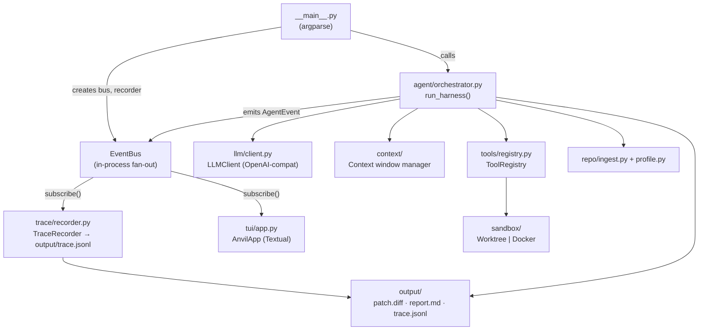
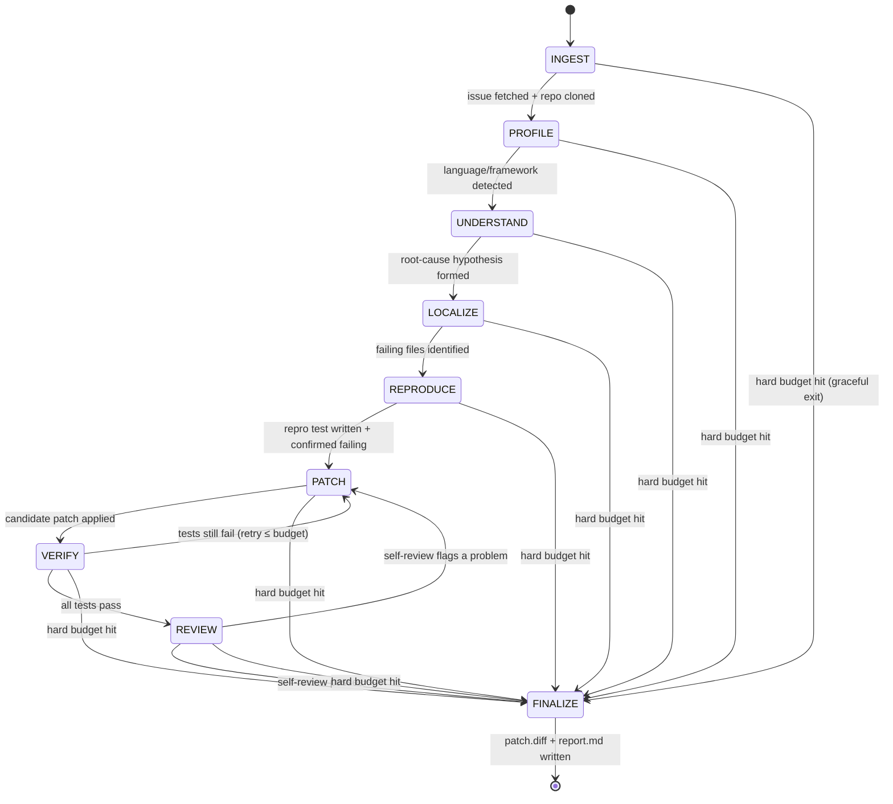

# ANVIL — Architecture

## 1. Component Diagram



---

## 2. Phase State Machine



Each phase transition emits a `phase` AgentEvent.  The orchestrator enforces
`max_steps_per_phase` and `max_total_steps`; breaching either forces a jump to
FINALIZE so the run always produces an output.

---

## 3. Data Flow

```
User supplies GitHub issue URL
        │
        ▼
INGEST  — parse URL → fetch issue JSON (GitHub REST, unauthenticated)
           → git clone --depth 1  → IssueRef + repo root Path
        │
        ▼
PROFILE — detect languages, test framework, install/test commands
           → RepoProfile + repo_map() (compact tree + top symbols)
        │
        ▼
UNDERSTAND — LLM reads issue body + comments + repo_map
              → root-cause hypothesis, key symbols/files list
        │
        ▼
LOCALIZE — LLM calls grep/read_file to narrow to exact lines
            → suspect file:line list
        │
        ▼
REPRODUCE — LLM writes a minimal failing test (run_cmd / run_tests)
             → confirmed FAIL before any source change
        │
        ▼
PATCH — LLM calls edit_file (exact str_replace) to fix the root cause
         → run_tests to see if repro passes
         → retry up to budget; rollback to checkpoint after N failures
        │
        ▼
VERIFY — run full test suite; confirm repro + neighbours pass
          → git_diff to collect the patch
        │
        ▼
REVIEW — LLM reads the diff as a reviewer; flags if patch is incomplete
          → may loop back to PATCH once
        │
        ▼
FINALIZE — write output/patch.diff, output/report.md
            → emit done AgentEvent with resolved_confidence
```

Every step is capped by:
- `tool_output_char_cap` (8 000 chars) per tool call
- `wall_clock_seconds` (30 min) for the whole run
- A loop detector that halts if the last N LLM outputs are identical

---

## 4. Decision Records

### DR-1 — Why a phase state machine?

**Context:** Unconstrained "just keep calling tools" agents tend to drift,
repeat themselves, and exhaust token budgets without producing a patch.

**Decision:** Enforce an explicit 9-phase FSM with per-phase step budgets.

**Consequences:** Each LLM call has a focused system prompt for its phase
(e.g. "you are in LOCALIZE — your only job is to identify the file and line").
The TUI can display clear progress.  Budget overruns cause a graceful jump to
FINALIZE rather than a crash.

---

### DR-2 — Why reproduce-first?

**Context:** Patches that "look right" often don't fix the actual failure.
Without a failing test, there is no objective pass/fail signal.

**Decision:** Before touching source files, ANVIL writes a minimal test that
reproduces the bug and confirms it fails.  Only then does it attempt a patch.

**Consequences:** The VERIFY phase has a binary signal.  Placebo patches are
caught.  The repro test is left in the diff as evidence.

---

### DR-3 — Why a git-worktree sandbox with optional Docker?

**Context:** Running arbitrary shell commands risks polluting the host.
Docker is safe but adds setup friction and is unavailable in some CI
environments.

**Decision:** Default to `git worktree` — a cheap, isolated copy of the repo
with its own working directory, no containerisation required.  Auto-detect
Docker and use it when present.

**Consequences:** Zero-dependency on Docker for the evaluator.  The `Sandbox`
protocol is the same regardless of backend; swapping is a config change.

---

### DR-4 — Why the tool-call text fallback?

**Context:** Some models/providers do not support the `tools` parameter of the
OpenAI chat-completions API, or return tool calls in a non-standard format.

**Decision:** The LLM client first attempts structured tool calls; if the
response contains no `tool_calls` field, it parses the text for a JSON code
block matching `{"tool": "...", "args": {...}}`.

**Consequences:** The system works with any OpenAI-compatible text-only model,
not just those with native function calling.

---

### DR-5 — Why context pruning?

**Context:** Long runs accumulate token history that exceeds the model's
context window or the budget.

**Decision:** The context manager keeps: the original issue + system prompt,
the current phase prompt, the last *K* assistant/tool turns, and a compressed
summary of earlier turns (via a short summarisation call).

**Consequences:** Runs stay within budget even for large repos.  Summaries are
lossless for code line references (file:line refs are preserved verbatim).

---

### DR-6 — Why an event bus?

**Context:** The TUI, trace recorder, and potentially future consumers (webhook,
metrics) all need to observe the same stream of agent actions.

**Decision:** An in-process publish-subscribe bus (`EventBus`) decouples
producers (agent) from consumers (TUI, recorder).  Each consumer gets its own
`asyncio.Queue`.

**Consequences:** Replay is free — loading `trace.jsonl` and re-emitting every
event produces an identical TUI experience without any API calls.  Adding a new
consumer (e.g. a webhook sink) is a one-liner.

---

## 5. Failure Modes and Recovery

| Failure | Detection | Recovery |
|---------|-----------|----------|
| GitHub API rate-limited (403) | HTTP status check in `fetch_issue` | Retry with backoff; fall back to `--repo + --issue-text` |
| Repo clone fails (network / auth) | Non-zero git exit code | Emit `error` event; skip to FINALIZE with empty patch |
| Tool call times out | `ExecResult.timed_out` flag | Return `ToolResult(ok=False, output="timed out")` to LLM; agent retries or skips |
| Patch makes tests worse | VERIFY step count > N | `sandbox.rollback()` to last checkpoint; re-enter PATCH |
| Loop detected (identical LLM outputs) | Hamming distance check on last 3 responses | Break loop; advance to next phase |
| Token budget exhausted | `max_tokens_total` counter | Flush FINALIZE immediately with whatever patch exists |
| Wall-clock limit | `time.time()` check at each step | Same as token budget |
| TUI receives unknown event type | `try/except` in `_handle_event` | Silently ignored; TUI never crashes |
| Trace file corrupted (last line) | `TraceRecorder.load` tolerant parser | Skips truncated last line; rest of trace is intact |

---

## 6. Scaling

ANVIL is designed to be stateless between runs:

- **Parallel workers:** The orchestrator reads config and emits events; there
  is no shared mutable state.  Multiple issues can be run in parallel processes
  with separate `output/` directories.

- **Sandbox pool:** The `Sandbox` protocol is an interface.  A container
  orchestrator (e.g. a Kubernetes Job per issue) can replace `WorktreeSandbox`
  without changing the agent logic.

- **Provider router:** `AI_BASE_URL` and `AI_MODEL` are env vars.  A router
  (e.g. LiteLLM, OpenRouter) can front multiple providers for cost control and
  fallback, transparent to ANVIL.

- **JSONL event log:** The trace file is append-only and crash-safe.
  A streaming consumer (e.g. Kafka, BigQuery) can tail it in real time.

- **Repo-map caching:** `repo_map()` output can be cached by repo SHA so
  re-runs on the same commit skip the profiling step.
